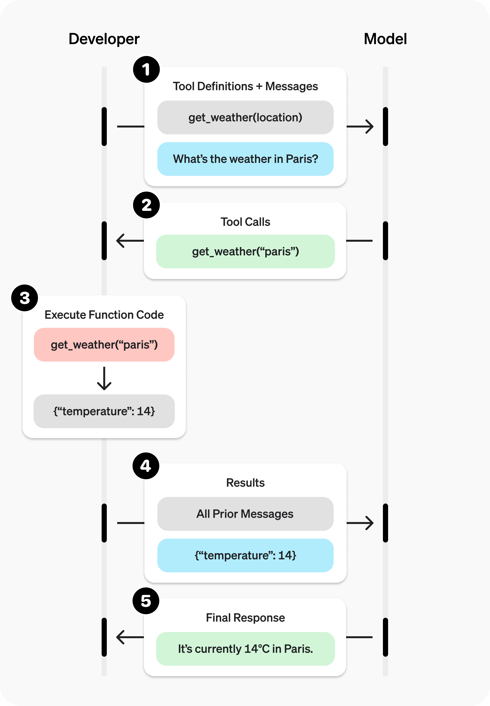
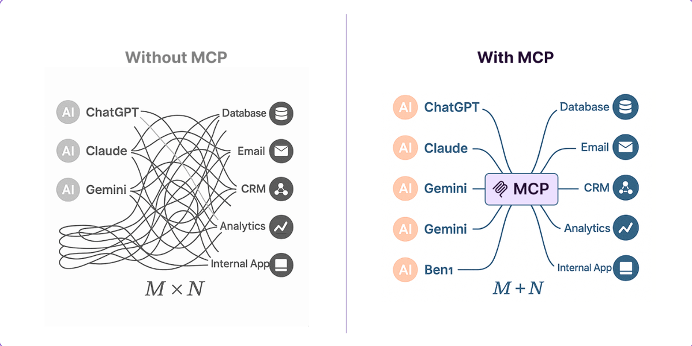
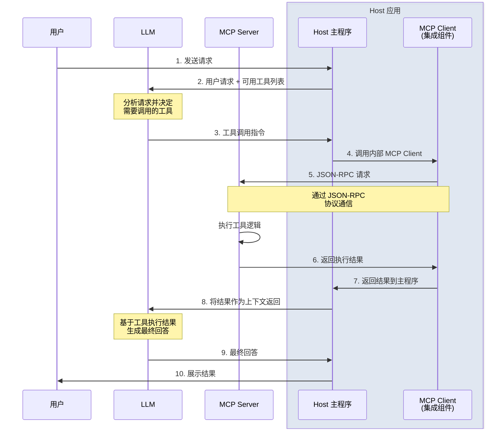
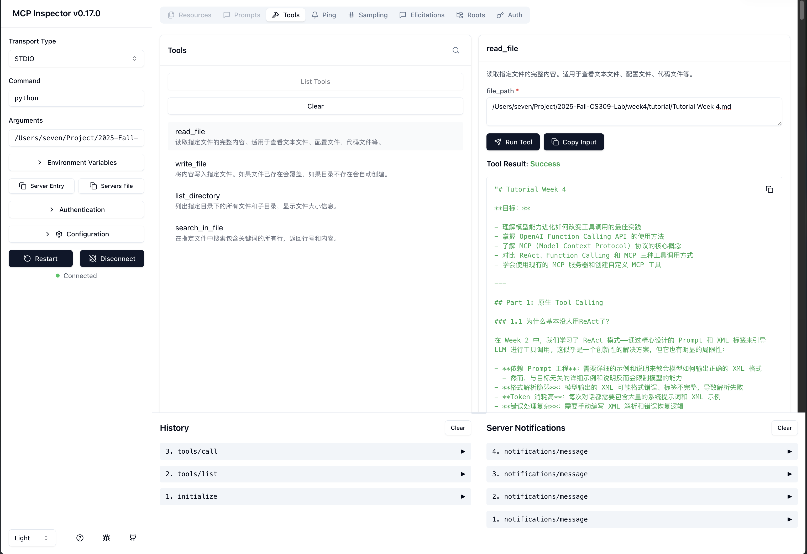

# Tutorial Week 4

**目标：**

- 理解模型能力进化如何改变工具调用的最佳实践
- 掌握 OpenAI Function Calling API 的使用方法
- 了解 MCP (Model Context Protocol) 协议的核心概念
- 对比 ReAct、Function Calling 和 MCP 三种工具调用方式
- 学会使用现有的 MCP 服务器和创建自定义 MCP 工具

---

## Part 1: 原生 Tool Calling

### 1.1 为什么基本没人用ReAct了？

在 Week 2 中，我们学习了 ReAct 模式——通过精心设计的 Prompt 和 XML 标签来引导 LLM 进行工具调用。这似乎是一个创新性的解决方案，但它也有明显的局限性：

- **依赖 Prompt 工程**：需要详细的示例和说明来教会模型如何输出正确的 XML 格式
  - 然而，与目标无关的详细示例和说明反而会限制模型的能力
- **格式解析脆弱**：模型输出的 XML 可能格式错误、标签不完整，导致解析失败
- **Token 消耗高**：每次对话都需要包含大量的系统提示词和 XML 示例
- **错误处理复杂**：需要手动编写 XML 解析和错误恢复逻辑

**为什么 ReAct 曾经是必要的？**

早期的 LLM（如 GPT-3.5）的指令遵循能力有限，无法可靠地输出结构化数据。因此，研究者们通过 Prompt 工程技术（如 Chain-of-Thought、ReAct）来引导模型一步步完成复杂任务。

**模型能力的跃迁**

随着新一代 LLM 的涌现（GPT-5、Claude 4.5、Gemini 2.5 等），模型能力发生了质的飞跃：

1. **更强的指令遵循能力**：模型能够准确理解和执行复杂的指令
2. **原生支持结构化输出**：模型可以直接输出 JSON、XML 等格式的数据
3. **Function Calling 成为标准特性**：主流 API 提供商都内置了工具调用功能

默认情况下，本课程推荐优先使用 Function Calling 来构建 Agent；只有在需要完全可控的自定义推理链或使用不支持函数调用的模型时，再考虑 ReAct。

---

### 1.2 OpenAI Function Calling API

[官方文档](https://platform.openai.com/docs/guides/function-calling)

Function Calling 允许模型智能地选择调用哪个工具，并生成符合工具定义的参数。

**核心概念**

1. **工具定义（Tool Definition）**：使用 JSON Schema 格式描述工具的功能和参数
2. **工具选择（Tool Choice）**：控制模型是否必须调用工具、调用哪个工具
3. **工具调用（Tool Calls）**：模型返回的结构化工具调用请求
4. **工具执行与反馈**：执行工具后将结果返回给模型

**Function Calling 工作流程图**



上图展示了完整的 Function Calling 流程：
1. 开发者发送工具定义和用户消息
2. 模型返回工具调用请求
3. 开发者执行函数代码并获取结果
4. 将结果返回给模型
5. 模型生成最终回答

**基本流程**

`week4/function_calling.py` 是以文件操作为例的 Function Calling 完整流程：

**重要参数说明**

- **`tool_choice`**:
  - `"auto"`: 模型自动决定是否调用工具（默认）
  - `"none"`: 强制不调用工具
  - `{"type": "function", "function": {"name": "read_file"}}`: 强制调用指定工具
  - `"required"`: 强制调用某个工具（任意一个）

- **`parallel_tool_use`**:
  - 模型可以一次性返回多个工具调用请求，并行执行以提高效率
  - 例如：同时读取多个文件或批量查询多条记录
  - 启用后需要根据 `tool_call.id` 将结果逐个写回，避免不同工具的输出混淆
  - 典型处理方式：

```python
response = client.chat.completions.create(
    model="gpt-5",
    messages=messages,
    tools=tools,
    parallel_tool_use=True
)

for tool_call in response.choices[0].message.tool_calls:
    result = available_functions[tool_call.function.name](**json.loads(tool_call.function.arguments))
    messages.append({
        "role": "tool",
        "tool_call_id": tool_call.id,
        "name": tool_call.function.name,
        "content": result
    })
```

  - 如果工具之间共享资源（例如同一文件或数据库连接），请自行控制并发，以免产生竞争条件

**执行流程说明**

在上面的例子中，模型会：
1. 收到用户请求后，分析需要先 `read_file` 读取文件
2. 返回第一个工具调用请求：`read_file("/tmp/todo.txt")`
3. 我们执行后将文件内容返回给模型
4. 模型再次调用工具：`write_file("/tmp/todo.txt", "# 今日任务\n原有内容...")`
5. 执行完成后，模型生成最终回答："已成功添加标题"

这展示了 Function Calling 的**多轮工具调用**能力。

**好在哪？**

在 ReAct 中，我们需要：
```xml
<thought>用户想修改文件，我需要先读取文件内容</thought>
<action>read_file("/tmp/todo.txt")</action>
<observation>文件内容...</observation>
<thought>现在我需要在开头添加标题，然后写回文件</thought>
<action>write_file("/tmp/todo.txt", "# 今日任务\n原有内容...")</action>
<observation>写入成功</observation>
<final_answer>已成功添加标题</final_answer>
```

在 Function Calling 中，模型直接返回结构化的工具调用：
```json
{
  "tool_calls": [{
    "function": {
      "name": "read_file",
      "arguments": "{\"file_path\": \"/tmp/todo.txt\"}"
    }
  }]
}
```

**优势显而易见**：
- ✅ 无需 XML 解析
- ✅ 参数自动 JSON 格式化
- ✅ API 自动校验参数类型
- ✅ 更少的 Token 消耗

---

### 1.3 量化对比

通过一个实际任务来对比 ReAct 和 Function Calling 的性能差异。

| 指标 | ReAct Agent (Week2) | Function Calling Agent | 差异 |
|------|---------------------|------------------------|------|
| **代码行数** | 221 行 | 311 行（含示例）| 核心实现：150 行 vs 80 行 |
| **平均 Token 消耗** | 1118 tokens | 478 tokens | ⬇️ **节省 57.2%** 🎯 |
| **平均响应时间** | 6.23 秒 | 3.97 秒 | ⬇️ **快 36%** ⚡ |
| **平均工具调用次数** | 2.3 次 | 1.3 次 | ⬇️ 减少 43% |
| **错误处理复杂度** | 手动 XML 解析 | API 自动处理 | ⬇️ 显著降低 |

**测试案例详情**：
- 简单文件读取: 986 → 364 tokens (63% 节省)
- 文件修改: 1106 → 639 tokens (42% 节省)
- 目录浏览: 1261 → 432 tokens (66% 节省)

**为什么 Function Calling 节省这么多 tokens？**

1. **系统提示更简洁**: JSON Schema (紧凑) vs XML 示例 (冗长)
2. **无标签开销**: 不需要 `<thought>`, `<action>`, `<observation>` 等 XML 标签
3. **工具调用更精准**: ReAct 有时需要多次尝试（目录浏览案例：4 次 vs 1 次）
4. **原生协议支持**: 模型直接输出结构化调用，无冗余文本

**实验代码**

可以使用 `compare.py` 脚本来自动化这个对比实验：

```bash
cd week4
python compare.py
```

这将运行 3 个测试案例并输出详细的对比报告。

---

## 1.4 工具设计最佳实践

基于实际经验，好的工具设计应该遵循以下原则：

1. **清晰的命名和描述**
   - ✅ 好的命名：`search_contacts`（搜索联系人）
   - ❌ 不好的命名：`list_contacts`（可能会列出所有联系人）
   - 使用命名空间避免混淆，如：`asana_projects_search`

2. **针对 Agent 优化，而非简单封装 API**
   - ✅ 好的设计：`schedule_event` 自动查找可用时间并创建日程
   - ❌ 不好的设计：分别提供 `list_availability` 和 `create_event`，让 Agent 暴力遍历

3. **控制输出的信息量**
   - 添加 `response_format` 参数，让 Agent 选择详细程度（`summary` vs `detailed`）
   - 避免返回低信号量的技术标识符（如 UUID），优先返回人类可读的信息
   - 使用分页或筛选，避免一次性返回大量数据淹没 Agent 的上下文

4. **明确的参数定义**
   - 提供清晰的类型、约束和示例
   - 必需参数 vs 可选参数要分明
   - 在描述中说明参数的作用和影响

5. **针对性工具而非万能工具**
   - ✅ 好的设计：`get_customer_context(customer_id)` 返回客户的关键信息摘要
   - ❌ 不好的设计：`get_customer_data(customer_id)` 返回客户的所有原始数据

> ⚠️ 设计工具时，要像对新同事解释任务一样去编写工具描述，而不是简单地暴露技术 API。


---

## Part 2: MCP (Model Context Protocol)

### 2.1 什么是 MCP

**Model Context Protocol (MCP)** 是由 Anthropic 在 2024 年提出的开放协议标准，旨在解决 LLM 应用中工具和数据源接入的碎片化问题。

**核心问题：M × N 的集成困境**

在 MCP 之前：
- 每个 LLM 应用都需要自己实现工具集成（文件读写、数据库查询、API 调用等）
- 工具无法跨应用复用，开发者重复造轮子
- 没有统一的安全和权限管理标准
- 工具生态碎片化，难以形成网络效应

如下图所示，每个 AI 应用（M 个）都需要单独对接每个数据源（N 个），导致 **M × N 的集成复杂度**：



**MCP 的解决方案：M + N 的标准化架构**

MCP 提供了一个统一的协议，让 LLM 应用（Host）可以通过标准接口访问各种工具服务器（Server）。这将集成复杂度从 **M × N 降低到 M + N**。

**类比理解**

- **传统方式**：每个电器都有专用的充电器（不兼容）
- **MCP 方式**：USB-C 统一接口，所有设备都能用（标准化）
- 适配器模式 & 桥接模式

**MCP 的现状：开发者的天堂 😅**


目前 MCP 生态还处于早期阶段，开发 MCP Server 的人远多于实际使用的人。但这正是生态爆发的前夜——就像早期的 npm、PyPI 一样，工具生态的建设总是先于大规模应用。

---

### 2.2 MCP 架构

**三个核心组件**

1. **MCP Host（客户端应用）**
   - 例如：Cursor、Claude Desktop、Github Copilot
   - 负责与用户交互，并通过 MCP 协议连接到工具服务器
   - 将工具能力暴露给 LLM 使用

2. **MCP Client（协议客户端）**
   - 嵌入在 Host 中的协议实现
   - 处理与 Server 的通信（通过 stdio 或 HTTP）
   - 管理连接、请求、响应

3. **MCP Server（工具服务器）**
   - 提供具体的工具和数据源
   - 例如：文件系统操作、数据库查询、API 调用
   - 通过 MCP 协议暴露能力



**通信方式**

- **stdio（标准输入输出）**
- **HTTP + SSE（Server-Sent Events）**

什么时候用stdio，什么时候用Streamable HTTP？
- 如果客户端/服务端在一台设备 -> stdio
- 如果跨设备通信 -> Streamable HTTP

**MCP 协议的三大核心能力**


1. **Tools（工具）**
   - 最重要的能力，大部分MCP Server仅提供工具
   - 可执行的函数，例如文件读写、代码执行、搜索查询
   - 使用 JSON Schema 定义参数和返回值
   - 示例：`read_file(path)`, `search_web(query)`

2. **Resources（资源）**
   - 暴露数据和内容，例如数据库记录、API 响应、图像、文档

3. **Prompts（提示模板）**
   - 预定义的提示词模板，方便用户快速开始特定任务
   - 支持参数化

---

### 2.3 MCP 生态系统

**MCP Hub 与服务器市场**

主流的 MCP 服务器发现平台：

**1. [Smithery.ai](https://smithery.ai/)**
- Anthropic 官方推荐的 MCP 服务器市场
- 提供一键安装、社区评分和详细文档
- 支持在 Claude Desktop 中直接配置

**2. [mcp.so](https://mcp.so/)**
- 开源的 MCP 服务器目录
- 实时更新的服务器列表
- 社区贡献的最佳实践

**官方维护的参考实现**

Anthropic 官方提供了一系列参考实现：[github.com/modelcontextprotocol/servers](https://github.com/modelcontextprotocol/servers)

常用的MCP：

- **`@modelcontextprotocol/server-filesystem`**：文件系统操作
  - 功能：读写文件、列出目录、搜索文件
  - 安装：`npm install -g @modelcontextprotocol/server-filesystem`

- **`@modelcontextprotocol/server-github`**：GitHub API
  - 功能：创建 Issue/PR、搜索代码、管理仓库

- **`@modelcontextprotocol/server-postgres`**：PostgreSQL 数据库
  - 功能：执行查询、获取表结构、数据分析

- **`@modelcontextprotocol/server-brave-search`**：网络搜索
  - 功能：实时网络搜索、新闻查询

可能对课程项目有帮助的：

- **`@upstash/context7-mcp`**：文档获取工具
  - 功能：查询主流库的文档
  - 特别适合在coding的时候降低模型幻觉

- **`@microsoft/playwright-mcp`**：来自微软的Playwright 自动化 MCP
  - 功能：让大模型控制浏览器

**如何使用现成的 MCP Server**

使用客户端：
- **Cherry Studio** :（开源的BYOK客户端，广泛的社区支持）
- **Claude Desktop**:（Anthropic 官方客户端，缺点是中国范围注册困难）
- **Codex/Claude Code**：（主要用于编码）

手写客户端：详见代码示例

以 `server-filesystem` 为例：

```bash
# 1. 安装（Node.js 方式）
npm install -g @modelcontextprotocol/server-filesystem

# 2. 在支持MCP的客户端中中配置（以Claude Desktop为例）
# 编辑 ~/Library/Application Support/Claude/claude_desktop_config.json
{
  "mcpServers": {
    "filesystem": {
      "command": "npx",
      "args": [
        "-y",
        "@modelcontextprotocol/server-filesystem",
        "/Users/yourname/Documents"  // 允许访问的目录
      ]
    }
  }
}

# 3. 重启 Claude Desktop，工具即可使用
```


---

### 2.4 三方对比：ReAct vs Function Calling vs MCP

让我们将 MCP 加入对比矩阵：

| 维度 | ReAct Agent | Function Calling Agent | MCP + Official Server |
|------|-------------|------------------------|----------------------|
| **实现代码行数** | ~220 行 | ~120 行 | ~50 行（仅客户端） |
| **工具定义方式** | 手写 Python 函数 + Prompt | 手写 Python 函数 + JSON Schema | **使用现成 Server，零代码** |
| **可维护性** | 低（耦合在代码中） | 中（函数与 Agent 分离） | **高（协议标准化）** |
| **可复用性** | 低（仅本项目） | 中（需手动适配） | **高（任何 MCP Host 都可用）** |
| **生态兼容** | 无 | 仅 OpenAI/兼容 API | **Claude Desktop、Continue.dev 等** |
| **错误处理** | 手动编写 | API 基础校验 | **协议级统一错误处理** |
| **跨应用共享** | 否 | 否 | **是（MCP 标准）** |

**关键洞察**

- **ReAct**：适合研究和自定义推理链，但生产环境不推荐
- **Function Calling**：主流方案，适合大多数应用场景
- **MCP**：最先进的方式，通过标准化协议实现工具生态共享，是未来方向

---

## Part 3: 实践项目

### 3.1 使用官方 MCP Filesystem Server

**任务**：使用官方的 `@modelcontextprotocol/server-filesystem` 完成 Week 2 的贪吃蛇任务

**步骤**

```bash
# 0. 安装 Node.js(如果未安装)
参考 https://nodejs.org/en/download

# 1. 安装 Python MCP SDK
pip install mcp

# 2. 全局安装 filesystem server（或使用 npx）
npm install -g @modelcontextprotocol/server-filesystem

# 3. 运行我们提供的客户端
cd week4
python mcp_official_client.py
```

**代码量对比**

- ReAct Agent: ~220 行（完整实现）
- Function Calling Agent: ~120 行（工具 + Agent）
- MCP Client: **~50 行**（仅客户端逻辑，工具由官方 Server 提供）

**体验差异**

使用 MCP 后，你只需要关注：
1. 连接到 MCP Server
2. 调用 LLM 并传入可用工具列表
3. 执行工具调用并返回结果

**所有工具的实现、安全检查、错误处理都由官方 Server 完成**，你无需重新开发。

---

### 3.2 使用 MCP Inspector 调试服务器

**什么是 MCP Inspector？**

`@modelcontextprotocol/inspector` 是Anthropic提供的调试工具，专门用于测试和调试 MCP 服务器。它提供了一个交互式的 Web 界面，可以：

- 查看服务器提供的所有工具、资源和提示模板
- 测试工具调用并查看返回结果
- 实时查看服务器日志和错误
- 无需编写客户端代码即可验证服务器功能

**如何使用**

```bash
npx @modelcontextprotocol/inspector
```

**Inspector 会：**
1. 启动你的 MCP Server
2. 在浏览器中打开调试界面
3. 连接到服务器并显示可用工具

**使用场景**

- ✅ **开发阶段**：快速验证工具定义是否正确
- ✅ **调试阶段**：查看工具调用的输入输出，定位问题
- ✅ **测试阶段**：在集成到实际应用前进行功能测试
- ✅ **文档演示**：向他人展示 MCP Server 的能力

**Inspector 界面功能**



> 💡 **最佳实践**：开发 MCP Server 时，始终先用 Inspector 测试，确认工具正常工作后再集成到实际应用中。

---

### 3.3 创建自定义 MCP Server

**场景**：官方 Server 不满足需求时，创建自己的工具

**示例**： `week4/mcp_custom_server.py` 提供了一个简单的 MCP Server 示例

**使用自定义 Server**

```bash

# 在支持mcp的 client中进行类似配置：
"custom_mcp": {
    "name": "custom_mcp",
    "type": "stdio",
    "description": "",
    "isActive": true,
    "command": "python",
    "args": [
    "Path/To/mcp_custom_server.py"
    ]
}
```

---

## Part 4: 最佳实践

### 4.1 工具设计原则

基于 Anthropic 的工程实践，好的工具设计应该：

**1. 为 Agent 优化，而非简单封装 API**

```python
# ❌ 不好：需要 Agent 多次调用遍历
@app.tool()
async def list_events(date: str) -> list:
    """列出某天的所有事件"""
    return await calendar.get_events(date)

# ✅ 好：智能化工具，一次完成任务
@app.tool()
async def schedule_meeting(title: str, duration_minutes: int,
                          preferred_date: str, participants: list[str]) -> str:
    """智能安排会议，自动查找所有参与者的共同空闲时间"""
    slots = await find_common_availability(participants, preferred_date)
    if not slots:
        return f"错误：{preferred_date} 没有 {duration_minutes} 分钟的共同空闲时间"
    event = await calendar.create_event(title, slots[0].start, slots[0].end, participants)
    return f"已成功安排会议：{event.url}"
```

**2. 控制信息量，避免上下文污染**

```python
from typing import Literal

@app.tool()
async def get_customer_info(
    customer_id: str,
    detail_level: Literal["summary", "detailed"] = "summary"
) -> str:
    """
    获取客户信息

    Args:
        detail_level: summary=关键信息, detailed=包含历史
    """
    # 根据 detail_level 返回不同详细程度的信息
```

**3. 清晰的命名和文档**

- 使用动词开头：`search_contacts` 而非 `list_contacts`
- 提供清晰的参数说明和示例
- 使用命名空间避免混淆：`asana_projects_search`

---

### 4.2 常见陷阱与解决方案

#### 陷阱 1：STDIO 模式下的 print 语句

```python
# ❌ 错误：破坏 MCP 协议
print("Debug: 处理请求...")

# ✅ 正确：输出到 stderr
import logging, sys
logging.basicConfig(handlers=[logging.StreamHandler(sys.stderr)])
logger = logging.getLogger(__name__)
logger.info("处理请求...")
```

#### 陷阱 2：忘记异步处理

> ⚠️ MCP服务器是**单线程异步**的（至少对于Python/TS/JS来说是这样的），要获取异步编程的更多内容，可以搜索：事件循环、协程、asyncio

```python
# ❌ 错误：阻塞事件循环
time.sleep(10)

# ✅ 正确：非阻塞等待
await asyncio.sleep(10)

# ✅ 同步 I/O 的处理方式
loop = asyncio.get_event_loop()
content = await loop.run_in_executor(None, read_large_file, file_path)
```

#### 陷阱 3：不安全的文件操作

```python
# ❌ 错误：可以读取任何文件
@app.tool()
async def read_file(path: str) -> str:
    with open(path) as f:
        return f.read()

# ✅ 正确：路径白名单验证
from pathlib import Path

ALLOWED_DIR = Path("/safe/workspace")

@app.tool()
async def read_file(path: str) -> str:
    file_path = Path(path).resolve()
    if not str(file_path).startswith(str(ALLOWED_DIR.resolve())):
        return f"错误：只能访问 {ALLOWED_DIR} 目录内的文件"
    with open(file_path) as f:
        return f.read()
```

---

## 扩展阅读

1. **OpenAI Function Calling 官方文档**
   [https://platform.openai.com/docs/guides/function-calling](https://platform.openai.com/docs/guides/function-calling)
   - Function Calling 的完整 API 文档和示例

2. **Anthropic: Writing Tools for AI Agents**
   [https://www.anthropic.com/engineering/writing-tools-for-agents](https://www.anthropic.com/engineering/writing-tools-for-agents)
   - 来自 Anthropic 工程团队的工具设计最佳实践
   - 真实案例分析和常见陷阱

3. **Claude Tool Use 文档**
   [https://docs.claude.com/en/docs/agents-and-tools/tool-use/overview](https://docs.claude.com/en/docs/agents-and-tools/tool-use/overview)
   - Claude 的工具调用能力和使用指南

4. **Anthropic MCP 协议规范**
   [https://modelcontextprotocol.io/](https://modelcontextprotocol.io/)
   - MCP 协议的官方文档和规范

5. **MCP 官方服务器仓库**
   [https://github.com/modelcontextprotocol/servers](https://github.com/modelcontextprotocol/servers)
   - 官方维护的参考实现和示例

6. **Smithery MCP 市场**
   [https://smithery.ai/](https://smithery.ai/)
   - Anthropic 推荐的 MCP Server 发现平台

7. **MCP 社区目录**
   [https://mcp.so/](https://mcp.so/)
   - 开源的 MCP Server 列表

8. **Claude Desktop MCP 配置指南**
   [https://modelcontextprotocol.io/quickstart/user](https://modelcontextprotocol.io/quickstart/user)
   - 在 Claude Desktop 中配置和使用 MCP

---

## 思考题

1. **模型进化**：为什么模型能力的提升使得原生 Tool Calling 效果超过 ReAct？在什么场景下 ReAct 可能仍然有优势？

2. **并行工具调用**：Function Calling 的 `parallel_tool_use` 特性在什么场景下最有用？能否举一个实际例子？

3. **MCP vs REST API**：MCP 协议与传统的 REST API 封装有什么本质区别？为什么 MCP 能够促进工具生态的形成？

4. **安全性设计**：如何设计一个安全的 MCP 代码执行工具？（提示：考虑沙箱、权限控制、资源限制）

5. **RAG 集成**：尝试将 Week 3 的 RAG 系统封装为 MCP Server，并在任意客户端中使用。你遇到了哪些挑战？

6. **生态探索**：从 Smithery.ai 或 mcp.so 中选择一个感兴趣的 MCP Server，集成到你的项目中，分享你的体验。

7. **成本优化**：在生产环境中，如何选择 ReAct、Function Calling 和 MCP？考虑开发成本、运行成本、维护成本等多个维度。

8. **协议演进**：MCP 目前还是一个相对新的协议。你认为它未来会如何发展？可能面临哪些挑战？

---

## 实验任务

### 任务 1：对比实验

运行 `compare.py` 脚本，对比三种方式（ReAct、Function Calling、MCP）完成相同任务的性能差异：

```bash
cd week4
python compare.py --task "创建一个贪吃蛇游戏" --runs 10
```

生成对比报告并分析结果。

### 任务 2：使用官方 MCP Server

安装并配置 `@modelcontextprotocol/server-filesystem`，使用它来完成一个文件操作任务（例如：整理文档、批量重命名等）。

### 任务 3: 创建自定义 MCP Server

创建一个自定义的 MCP Server，能够让大模型进行多项式计算，并在mcp-inspector中测试其功能（推荐使用Sympy库完成）

